# NACOS AAUA E-VOTING SOFTWARE

This is a software designed and developed by [Enoch Olayode](https://github.com/ENOCH1234)

The link to the original repo is at: [https://github.com/ENOCH1234/nacos-aaua-voting](https://github.com/ENOCH1234/nacos-aaua-voting)

The files were forked and updated for the 2026 NACOS AAUA Election by Tony-Akinlosotu Favour [(ZayonSoft)](https://zayonsoft.vercel.app) and they can be cloned at:
[https://github.com/zayonsoft/nacos-aaua-voting.git](https://github.com/zayonsoft/nacos-aaua-voting.git)

This system is designed to operate locally and supports seamless connectivity to additional nodes (computers/devices) , with one instance designated as the server

---

## Table of Contents

-[Getting Started](#getting-started)

- [Prerequisites](#prerequisites)
- [Installation](#installation) -[Server Web Interface](#web-interface-for-the-server-computer-on-the-device-that-is-the-server)
- [Connecting Multiple Systems](#connecting-the-systems-on-the-same-network) -[Interface For Client Computers](#web-interface-for-clients-connected-computers)

---

## Built With

- PHP

---

## Getting Started

Instructions to set up the project locally

### Prerequisites

- Install XAMPP
  You can follow the link: [https://sourceforge.net/projects/xampp/files/XAMPP%20Windows/8.2.12/xampp-windows-x64-8.2.12-0-VS16-installer.exe/download](https://sourceforge.net/projects/xampp/files/XAMPP%20Windows/8.2.12/xampp-windows-x64-8.2.12-0-VS16-installer.exe/download)

- Text Editor (e.g VS Code or Note Pad)

---

### Installation

1. Clone the repository the forked repo

```bash
git clone https://github.com/zayonsoft/nacos-aaua-voting.git
```

or the original repo

```bash
git clone https://github.com/ENOCH1234/nacos-aaua-voting.git
```

2. Move the folder (nacos-aaua-voting) into `C:\xampp\htdocs\` (if you didn't clone it into this directory)

- Note: The htdocx should be in the directory where xampp is installed

3. Open XAMPP Control Panel and start the Apache and Sql Server

   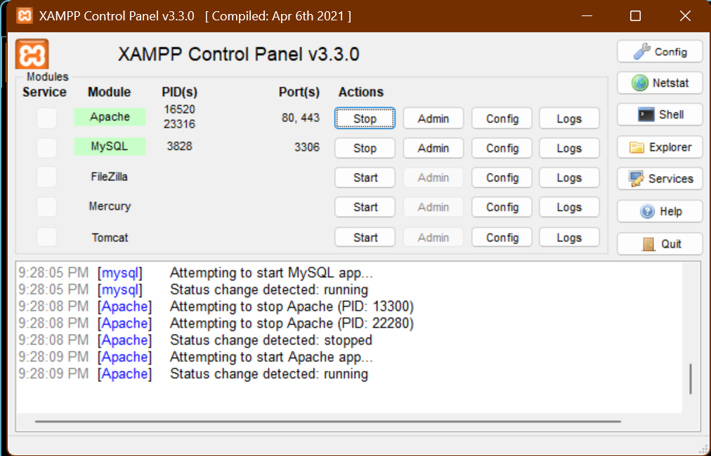

4. Setup the database

- Click on SQL Admin Button After running the server to open the admin panel on the browser

  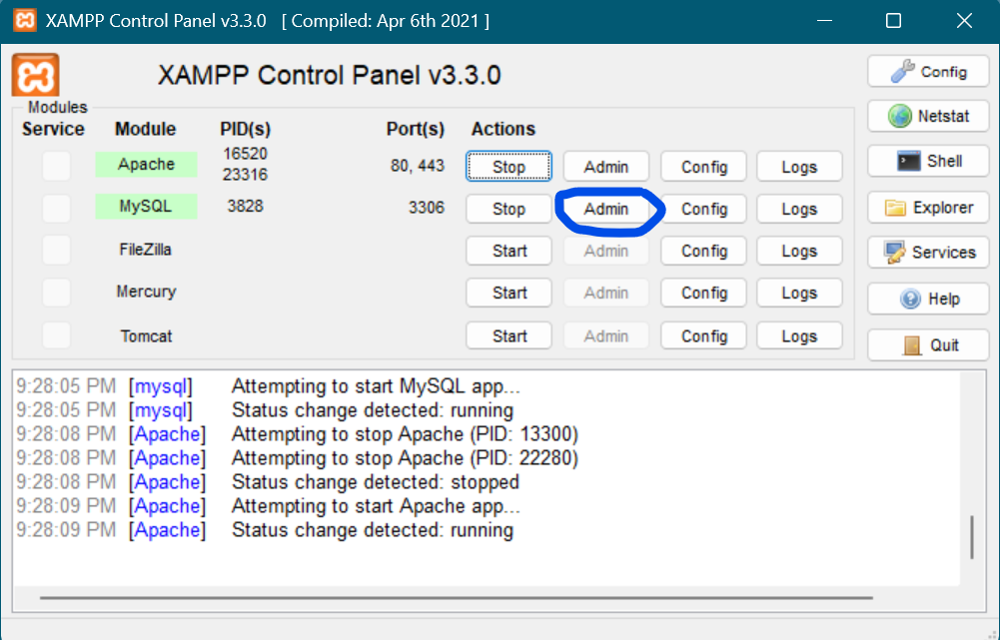

- On the Left Hand Side Click on New and Create a db named `votesystem`

  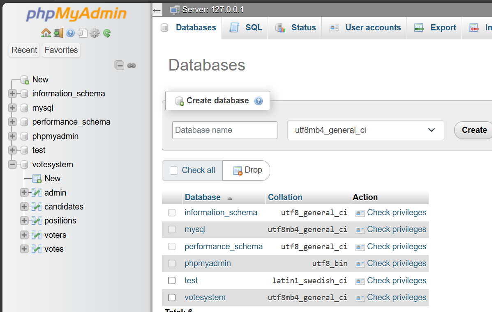

- Click on the Import Tab and import the data from `db/votesystem.sql`

  - see [db/votesystem.sql](db/votesystem.sql)
    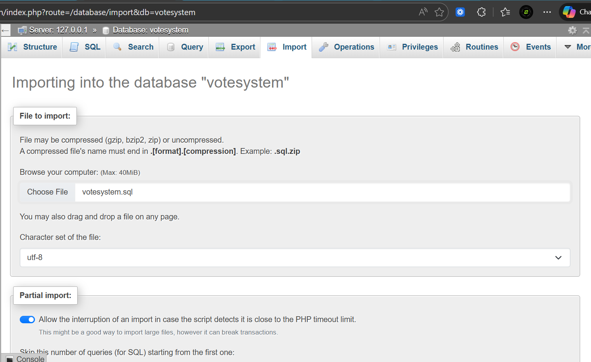

4. Enabling Voter Spreadsheet Upload

- open `C:\xampp\php\php.ini`
  Edit
  `;extension=zip`
  to

`extension=zip`
Note: Without this Voter Upload Will Fail

---

## Web Interface for the Server Computer (On the device that is the server)

1. Go to your browser and type: `http://localhost/nacos-aaua-voting/` - Note: This will automatically take you to the Voter Login Page

   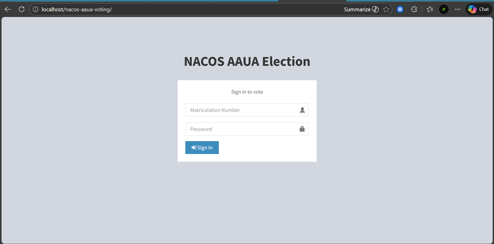

2. To Access the Admin Login Page enter `http://localhost/nacos-aaua-voting/nacos_admin`

   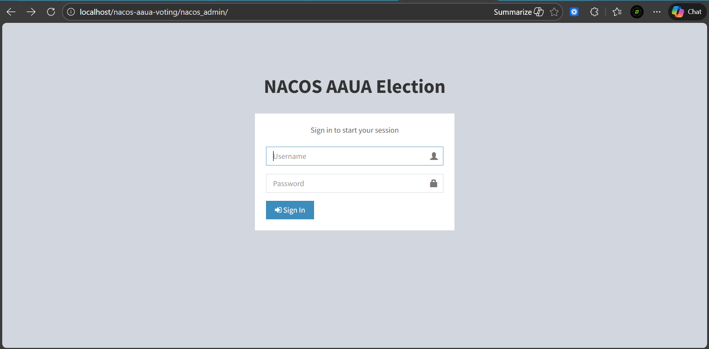
   The default admin username is: `nacos_aaua`
   Default Password is: `admin`

---

## Connecting The Systems On The Same Network

1. The first step is to put all the computers involved on the same network with the server (i.e connect them to the same hotspot or wifi)

2. Make sure the network is set as private

- to verify this click on network properties

  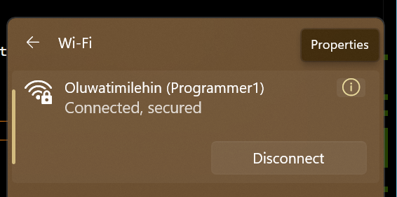

- If it is Public Network Like the Image below (PUBLIC NETWORK WILL NOT WORK)

  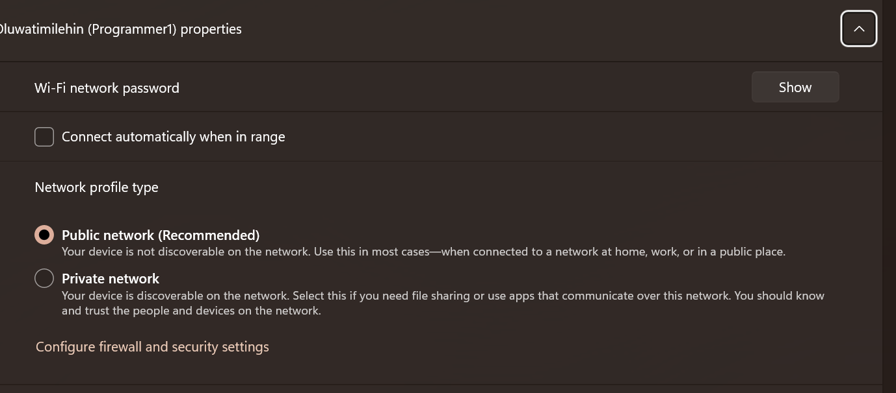

- Change it to Private

  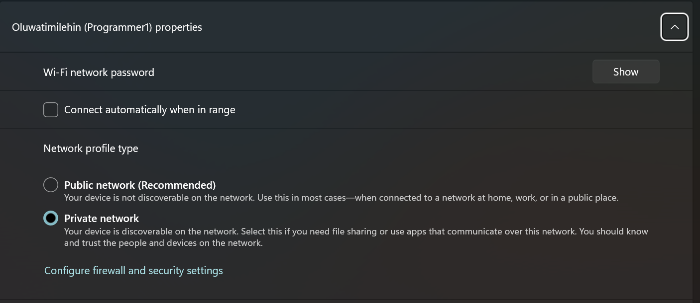

3. Find out what the server's public IP is

   - Open Command Prompt (Search Command Prompt in Apps or press Winkey + R, type CMD and enter).
   - In command prompt type ipconfig

   ```bash
   ipconfig
   ```

   - Your IPV4 Address is what is needed (In this case it is: `192.168.43.166` )

     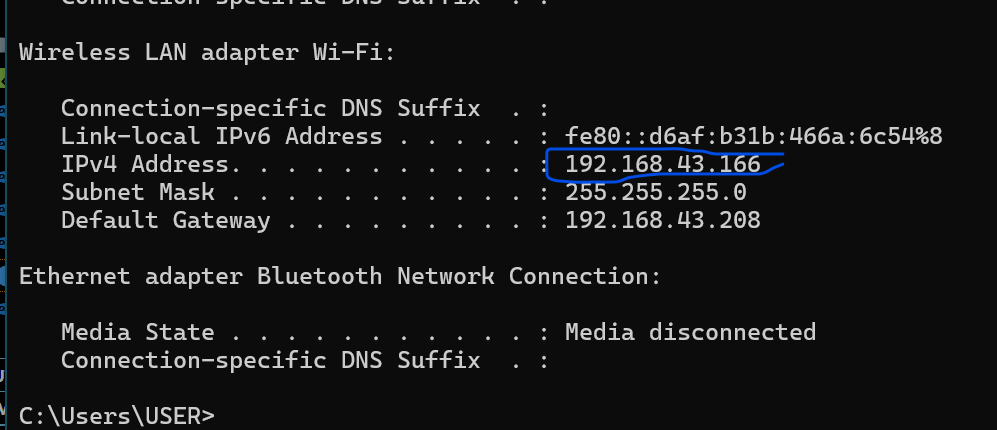

4. Verify that the server is accessible from other connected computers. If Ping ensure that all the steps above are followed

```bash
ping <ip-address>
```

---

## Web Interface for Clients (Connected Computers)

1. Go to the browser and type: `http://<ip-adress>/nacos-aaua-voting/` and it automatically takes you to voter login (replace IP address with server IP)

   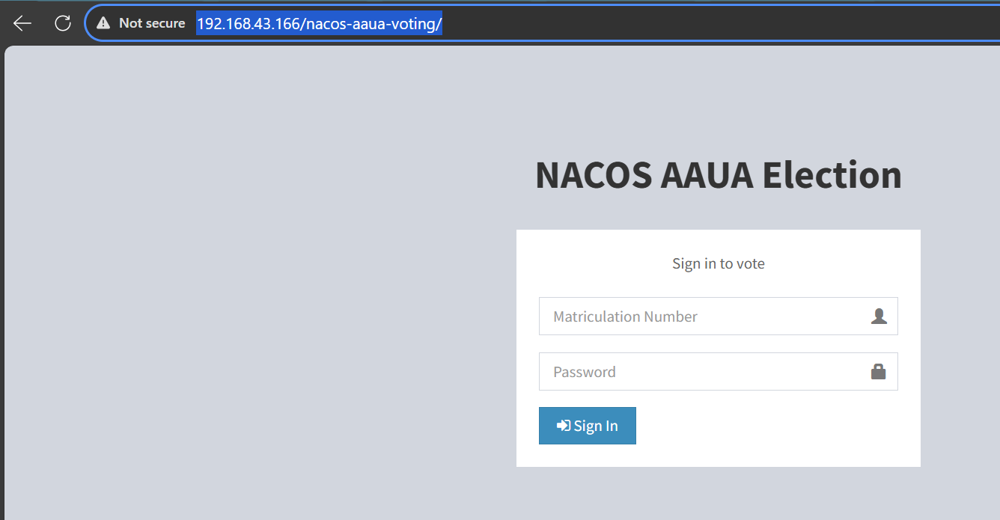

2. To access the admin login go to `http://<ip-adress>/nacos-aaua-voting/nacos_admin`
   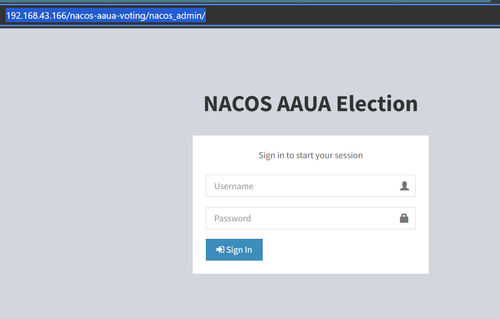
